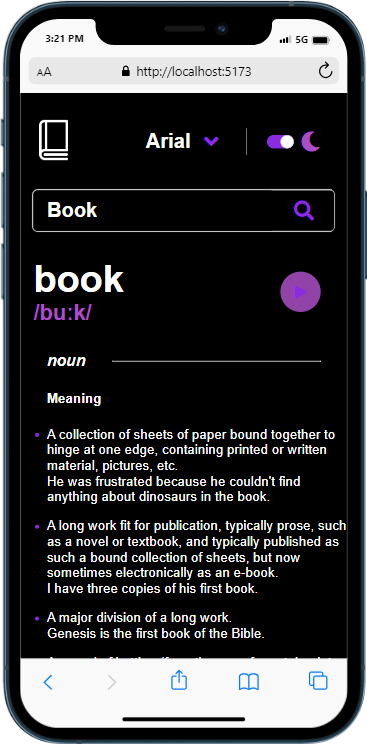
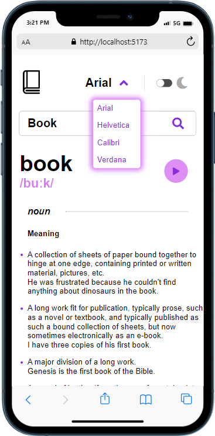
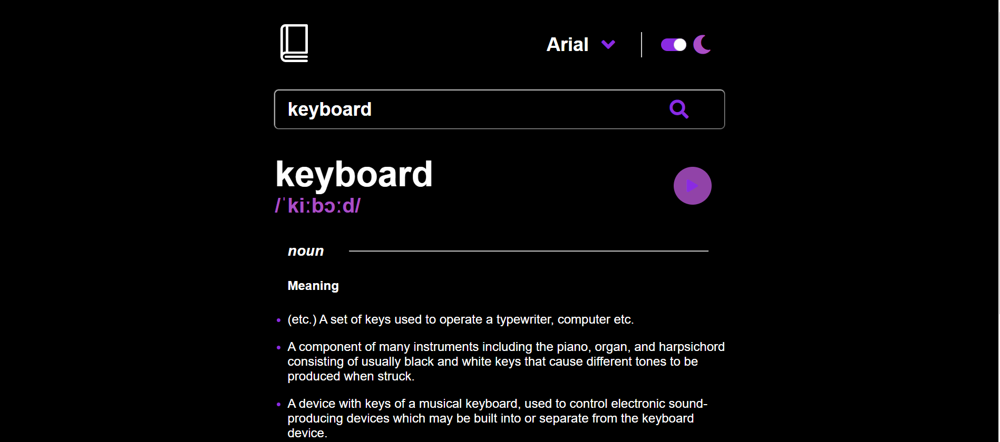

# DictionaryWebAPP

DictionaryWeb is a user-friendly web application that allows users to access dictionary definitions, synonyms, antonyms, and example sentences for various words. The app consumes a dictionary API to provide accurate and up-to-date word information, empowering users to enhance their vocabulary and language comprehension.

## ScreenShots




##  Live
https://booktionary.netlify.app
## Features

- **Word Definition:** Get comprehensive definitions for searched words.
- **Synonyms & Antonyms:** Explore lists of synonyms and antonyms for each word.
- **Example Sentences:** View example sentences for a better understanding of word usage.
- **Word Pronunciation:** Listen to audio pronunciation for correct articulation.
- **Responsive Design:** Enjoy seamless user experience across various devices (desktop, tablet, mobile).
- **User-Friendly Interface:** Intuitive design for easy navigation and efficient word search.

## How to Use

1. **Search:** Enter a word in the search bar and click the "Search" icon to look up its definition and related information.

2. **Synonyms & Antonyms:** Find synonyms and antonyms of a given worn

3. **Example Sentences:** View example sentences for a word

4. **Word Pronunciation:** To hear the word's correct pronunciation, click on the speaker icon next to the word.

## Development Setup

1. Clone the repository:

2. Install dependencies:

3. Run the app:

4. Access the app in your web browser at http://localhost:3000

## Contributing

Contributions are welcome! If you have any suggestions, bug reports, or new feature ideas, please open an issue or submit a pull request.

## License

This project is licensed under the MIT License - see the [LICENSE](LICENSE) file for details.

## How to install
1. **Clone the Repository**:

   Open your terminal or command prompt and navigate to the directory where you want to clone your repository. Then, run the following command:

   ```bash
   git clone https://github.com/munyite001/dictionary-web-app.git
   ```

2. **Navigate to the Project Directory**:

   Move into the project directory using the `cd` command:

   ```bash
   cd dictionary-web-app
   ```

3. **Install Dependencies**:

   Install the project dependencies using npm or yarn. Let's use npm in this example:

   ```bash
   npm install
   ```

4. **Run the App**:

   To start the development server and run your app, use the following command:

   ```bash
   npm run dev
   ```

   This command will build and serve your app, and you'll see output indicating that the development server is running.

5. **Open in Browser**:

   Open your web browser and navigate to `http://localhost:5173`. You should see your dictionary web app running.

6. **Explore and Use the App**:

   You can now interact with your app as intended. Search for words, toggle themes, and select fonts as you have implemented in your app.
